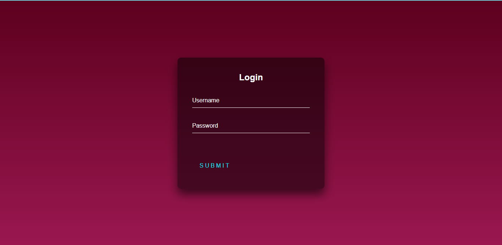

## Login-Page
**This repo. contain a "Login page" , That I have made during learning and practicing HTML & CSS.**
 

## Objective and Requirements:
- Goal: Created Login Page with some cool CSS.
- Dev tools  &nbsp; :  &nbsp; &nbsp;   &nbsp;   
   *  Using HTML ( Creating the structure 🏗️ ) 
   *  Adding CSS ( Giving cool style ✨ )
- Required: editor and browser

##  :camera: Snapshot of Project:

 

